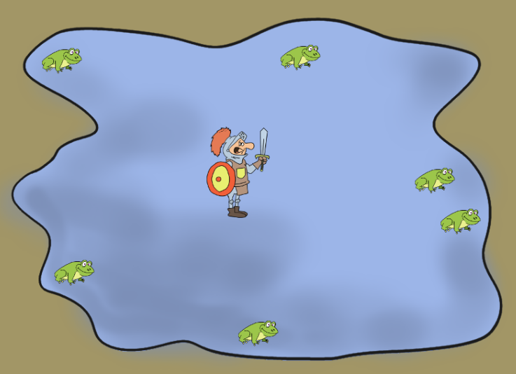

Han convertit la princesa en granota!
=======================================
Una malvada bruixa ha convertit la princesa del nostre regne en una granota (maleïda bruixa no sap que és el príncep el que s’ha de convertir en granota?). 

La única forma de trencar l’encanteri és que un cavaller blau li faci un petó (no cal que sigui un príncep com marca la tradició perquè la bruixa és una maleïda republicana) …

La tasca és senzilla, només cal capturar la granota, fer-li un petó i la princesa i el príncep podran fer allò que fan els prínceps quan estan sols 

> nota: no és menjar perdius ni anissos, però si que té a veure amb ser feliços … 

Però hi ha un problema, la princesa s’ha integrat en el paper i s’ha llançat a una bassa d’aigua on hi ha altres granotes … S’atrevirà el cavaller a fer un petó a una granota sense saber si és la princesa o no?

Tasca
--------
Princesa a l’aigua

Es tracta de fer un programa, fent servir la llibreria ACM JFT, que permeti a un usuari  moure’s per l’estany i capturar la princesa convertida en granota.

* El príncep es mou per la pantalla amb el teclat però no en pot sortir
* Si la granota capturada no és la princesa el príncep es desmaia i quan es recupera: 
    * les granotes han canviat de posició 
    * La granota que el cavaller ha petonejat va quedar embarassada i ha aparegut una nova granota

El joc acaba quan el príncep ha trobat la princesa o bé hi ha *massa granotes* (decidiu què és 'massa')

[Resum de ACM JTF](http://projectes.cendrassos.net/acm/)
